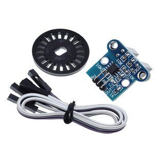
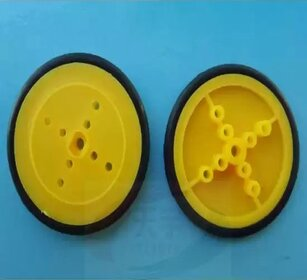
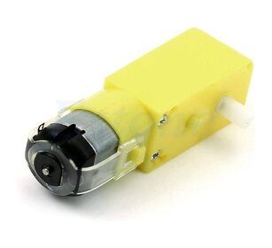

# Micromouse Project

Welcome to the Micromouse project repository! This project showcases a small autonomous robot designed for maze navigation. Explore this project if you're interested in robotics and autonomous systems.

## Table of Contents
- [Hardware Components](#hardware-components)
- [Software](#software)
  - [Controlling the Robot](#controlling-the-robot)
  - [Algorithms](#algorithms)
- [Installation](#installation)
- [Contributing](#contributing)
- [Contact](#contact)

## Hardware Components

The Micromouse project utilizes the following hardware components:

### PCB (Printed Circuit Board)

The central control hub that connects and manages all other components.

You can find all details and schematic [Here](https://oshwlab.com/om4rr/micromouse).

### Ultrasonic Sensor

Measures distances and detects obstacles for navigation.

### IR Sensor (Infrared Sensor)

Detects lines and walls for precise navigation in mazes.

### Optical Encoder

Tracks wheel movements for accurate control.

### Wheels 

The wheels of the robot.

### 3D Design

We have designed a custom 3D chassis for the robot. Here's a photo of our 3D design:

### Bluetooth Module

Allows remote debugging and control for monitoring the robot.

### Motors

Drive the wheels for movement.

### Freewheel (Caster Wheel)

Provides stability and maneuverability during turns.

### Gyroscope (MPU6050)

Measures angles and helps maintain orientation for accurate navigation.

## Software

### Controlling the Robot

#### Angle Control with PD System

We've implemented a PD (Proportional-Derivative) control system for angle control using the Gyroscope (MPU6050) as the feedback element. The primary goal of this system is to keep the robot moving in a straight line and execute precise 90-degree turns when needed.

- **Proportional (P):** The proportional part of the controller ensures that the desired angle remains static, allowing the robot to move in a straight line.

   Functionality: When P is adjusted, it affects how quickly the robot corrects deviations from a straight path.

- **Derivative (D):** The derivative part helps fine-tune the turning process.

   Functionality: Tuning D affects how the robot responds to deviations in the angle, contributing to stable and precise turns.

For graphs and visualizations of the tuning process, please click [Testing/PID_CALC](Testing/PID_CALC) to access the response graphs.

#### Sensor Reading

To navigate the maze effectively, the robot continuously reads sensors located in every cell. Here's how the sensors work:

- **Ultrasonic Sensors:** These sensors detect obstacles, specifically walls, by measuring distances. This information helps the robot avoid collisions and navigate around maze walls.

- **IR Sensors (Infrared Sensors):** While the robot is designed to move in a straight line, minor alignment issues can occur. The IR sensors play a crucial role in detecting deviations from a straight path. If an IR sensor reads a signal, it indicates that the robot is getting too close to a wall.

   Functionality: In response to IR sensor readings, we make minor adjustments to the desired angle, typically by 5 degrees, to correct the alignment and maintain a straight path.

By combining precise angle control and sensor readings, our robot can successfully navigate the maze with accuracy and efficiency.

### Algorithms

[Describe the algorithms used for maze-solving and navigation.]

## Installation

1. You can download the latest version of the Micromouse project as a ZIP file by clicking [here](link_to_zip_file.zip).

## Contributing

While this project primarily serves as a showcase, I welcome suggestions and improvements. Feel free to create issues or send pull requests.

## Contact

For inquiries or to get in touch, you can reach me at [your contact email]. Enjoy exploring the Micromouse project!
